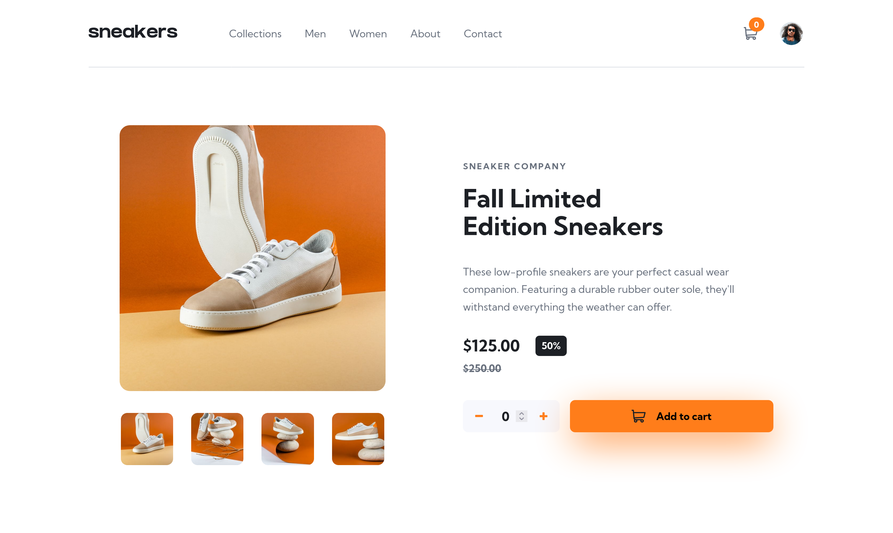

# Frontend Mentor - E-commerce product page solution

This is a solution to the [E-commerce product page challenge on Frontend Mentor](https://www.frontendmentor.io/challenges/ecommerce-product-page-UPsZ9MJp6). Frontend Mentor challenges help you improve your coding skills by building realistic projects.

## Table of contents

- [Overview](#overview)
  - [The challenge](#the-challenge)
  - [Screenshot](#screenshot)
  - [Links](#links)
- [My process](#my-process)
  - [Built with](#built-with)
  - [What I learned](#what-i-learned)
  - [Continued development](#continued-development)
  - [Useful resources](#useful-resources)

## Overview

### The challenge

Users should be able to:

- View the optimal layout for the site depending on their device's screen size
- See hover states for all interactive elements on the page
- Open a lightbox gallery by clicking on the large product image
- Switch the large product image by clicking on the small thumbnail images
- Add items to the cart
- View the cart and remove items from it

### Screenshot

### Links

- Solution URL: [Ecommerce Product Page](https://www.frontendmentor.io/solutions/responsive-ecommerce-product-page-with-lightbox-using-scssjs-5n6Zg-Ln9E)
- Live Site URL: [Ecommerce Product Page](https://fem-ecommerce-product-page-black.vercel.app/)

## My process

### Built with

- Semantic HTML5 markup
- CSS custom properties
- Flexbox
- [Vite](https://vite.dev/guide/) - build tool

### What I learned

- About state management and reusing code to manage state.
- Creating a custom gallery with overlay and sliding transitions
- Keyboard navigation accessibility for different case scenerios

### Continued development

- Making other e-commerce functionalities that a typical e-comm site has
- Making it accessible for screen readers as well

### Useful resources

- [Lightbox Image Gallery](https://www.youtube.com/watch?v=_h6iT2UnyVs) - This helped me create a basic lightbox gallery which was the main challenge here.
- [Popup modal](https://www.youtube.com/watch?v=r8BfBtB51uw) - This helped me create a cart modal popup.
